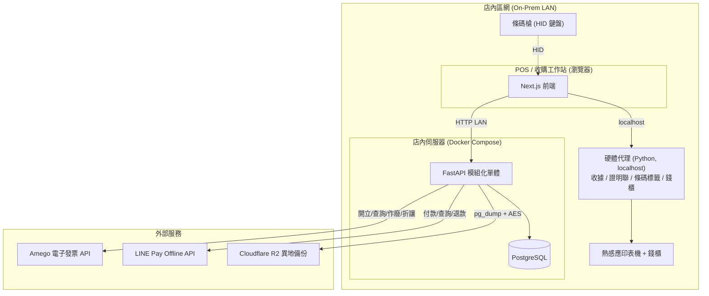
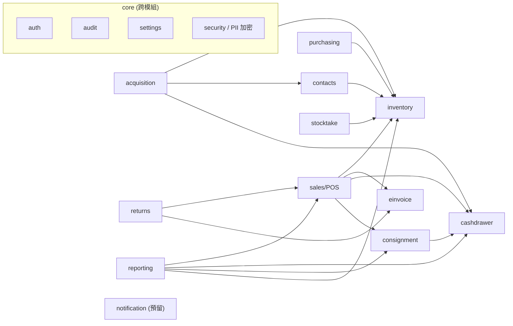

# 02 — 架構設計

## 1. 需求摘要

**功能性**：收購（買斷）、寄售、二手與全新商品/飲料的庫存與銷售、多付款方式 POS、
電子發票（Amego、可開關）、現金對帳、盤點、退換貨、供應商採購、財務報表、稽核。

**非功能性**：店內優先/外網可降級、PII 加密與稽核、Decimal 金額一致性、自動備份、多分店就緒、低維運（無 DBA）、TDD。

**約束**：後端 Python+FastAPI、前端 Next.js、可本地部署、嚴格專案結構；現金／購物金在
店內可運作，Amego／LINE Pay 等外部服務須 fail closed 或保留可對帳狀態；叫號機外購不實作。

## 2. 高階架構圖

## 3. 模組分解（模組化單體）

> 跨模組僅能透過對方 `service` 介面互動，不得直接存取對方 repository/資料表。

## 4. 技術選型與理由

| 層 | 選型 | 理由 | 替代方案 |
|----|------|------|----------|
| 後端 | FastAPI（模組化單體） | 部署單純、型別友善、async；單店規模不需微服務 | 微服務（過度工程）、Django（較重） |
| ORM | SQLAlchemy 2.0 typed + Alembic | 成熟、可控 SQL、migration 完整 | SQLModel（較新但生態較淺） |
| DB | PostgreSQL（容器化） | ACID、關聯查詢、欄位加密、零維運即可用 | SQLite（多終端寫入與一致性不足，不採用）、MySQL |
| 前端 | Next.js App Router + TS | 易部署、可本地運行、生態成熟 | Vite SPA（亦可，但 Next 較完整） |
| 硬體 | 獨立 Python 硬體代理 (ESC/POS) | 瀏覽器無法直接驅動印表機/錢櫃 | WebUSB（相容性差，不採用） |
| 發票 | Amego API + 持久 outbox／對帳 | 委外配號、B2B/B2C 與證明聯資料一次整合；未知結果可追蹤 | 自建 Turnkey（已停用） |
| 部署 | Docker Compose（店內） | 一鍵起停、易搬遷、低維運 | k8s（過度工程） |

## 5. 部署拓樸

- 店內一台伺服器跑 `docker compose`：`postgres` + `backend(api)` + `frontend` + `hardware-agent`（代理也可只跑在 POS 機，視機器配置）。
  - 開發階段：`docker compose` **只起 PostgreSQL**，backend/frontend/hardware-agent 用 uv/pnpm 本機跑；上述完整服務 compose 於 **Phase 7（部署）** 才建置。
- 後端直接連 Amego／LINE Pay；App Key 與金流憑證只由正式環境注入，不入 repo/DB。
- due-driven `pg_dump` 以 AES 加密後上傳 Cloudflare R2；本地儀表板顯示備份健康與還原演練狀態。
- 外網中斷時：現金／購物金 POS 與收購照常；Amego 發票保留待對帳狀態，LINE Pay 不得假裝付款成功。

## 6. Architecture Decision Records (ADR)

> 後續新決策請續編於 `docs/adr/`，沿用以下格式。

### ADR-001：採用模組化單體而非微服務
- **Status**: Accepted
- **Context**: 單店、小資料量、需低維運與簡單部署，但要保留未來多分店擴張。
- **Decision**: 以 FastAPI 模組化單體實作，依領域切模組、嚴格分層、模組間僅經 service 介面互動。
- **Alternatives**: 微服務（運維與部署成本過高，與單店規模不符）；大泥球單體（未來難拆）。
- **Consequences**: ＋部署/維運簡單、開發快；－單一程序，需靠模組邊界紀律維持可拆性。
- **Trade-off**: 以「邊界紀律」換取「低運維」，並保留日後拆分空間。

### ADR-002：PostgreSQL 容器化 + `store_id` 全面就緒
- **Status**: Accepted
- **Context**: 不想要 DB 維運；但要支援多終端寫入與未來多店。
- **Decision**: 容器化 PostgreSQL，自動備份；每張業務表帶 `store_id`。
- **Alternatives**: SQLite（並發寫入/一致性不足）；一開始就上雲託管（現階段非必要成本）。
- **Consequences**: ＋零調校可用、未來可無痛換雲端託管 DB；－需維護備份排程（已自動化）。
- **Trade-off**: 現在容器自管、未來可換 RDS/Supabase，程式碼不變。

### ADR-003：本地硬體代理驅動列印與錢櫃
- **Status**: Accepted
- **Context**: 瀏覽器無法可靠驅動熱感應印表機/錢櫃。
- **Decision**: POS 機跑獨立 Python 代理，localhost 暴露列印/開櫃端點（ESC/POS）；條碼槍走 HID 由前端直接接收。
- **Alternatives**: WebUSB/WebSerial（裝置相容性與權限問題）。
- **Consequences**: ＋穩定、與瀏覽器解耦；－多一個需部署的元件。

### ADR-010：硬體代理提供裝置狀態回報，前端輪詢顯示面板
- **Status**: Accepted
- **Context**: 店員需即時掌握各機器（Brother QL-810W 標籤機、EPSON TM-T82iii 收據/發票機、掃碼槍、錢櫃）是否在線與細部狀態，避免列印才發現離線；前端不可直接驅動硬體。
- **Decision**: 由 hardware-agent 作為硬體狀態的唯一抽象來源，暴露 `GET /devices/status`（見 04）。回報分兩級：**A 級**（連線/離線 + 最後回應時間心跳，保證做到）與 **B 級**（缺紙/上蓋/錯誤/錢櫃開啟等，依各機型官方 Python SDK 實際支援度，查不到者標記 `unsupported`、不臆造）。前端 `lib/hardware.ts` **定時輪詢**該端點顯示成唯讀面板，不直接碰硬體。
- **Gate**: 實作 B 級前必須先取得兩台機器官方協定／SDK 文件，依實際狀態查詢能力實作，
  不得推測未提供的硬體能力。
- **Consequences**: ＋單一抽象、前端與硬體解耦、能力誠實（不假裝支援）；－各機型能力不齊，面板需處理「不支援」態與輪詢失敗（代理離線）態。

### ADR-004：電子發票以 MIG XML 拋檔 + 開關 + 離線佇列
- **Status**: Superseded（2026-07-09，由下列 ADR-013 取代）
- **Context**: 法規要求電子發票；草創期需可關閉；外網可能不穩。
- **Historical decision**: 原規劃自建 Turnkey/MIG XML 拋檔；研究留在 docs/14、docs/18，
  但不得再據此施工或部署。

### ADR-013：電子發票改採 Amego API + 持久對帳狀態機

- **Status**: Accepted / Implemented
- **Context**: 需要 B2B/B2C 開立、作廢、折讓與證明聯，又要避免自管字軌、Turnkey 主機與 XSD。
- **Decision**: 使用 Amego f0401/f0501/g0401 API；銷售先落庫，平台成功才標正式狀態。
  每次上送先持久認領 payload 與世代，重送前先查詢對帳；未知結果維持 PENDING，明確拒絕才 FAILED。
  `einvoice_enabled` 保留，銷售一律完整記錄並與開票結果解耦。
- **Alternatives**: 自建 Turnkey（維運／配號／XSD 成本較高）；不開電子發票（不符合營運需求）。
- **Consequences**: ＋正式流程較小、平台回傳可直接列印；－外部 API 可用性與憑證成為部署輸入，
  必須保留 fail-closed、冪等與人工對帳退路。詳細不變量見 docs/24。

### ADR-005：PII 欄位層級加密 + 稽核
- **Status**: Accepted
- **Context**: 收購/寄售強制蒐集 `national_id`，屬高度敏感個資。
- **Decision**: 欄位層級加密儲存，金鑰由環境/KMS 管理；僅 `MANAGER` 可解密查看且寫稽核；禁入 log 與一般回應。
- **Consequences**: ＋符合個資保護、降低外洩風險；－查詢該欄位需解密、不可直接索引明文（如需比對採確定性加密或雜湊索引，另行評估）。

### ADR-006：前端 Next.js 經 LAN 連本地後端，不做離線 PWA
- **Status**: Accepted
- **Context**: 所有資料都在店內伺服器，POS 與後端同處區網。
- **Decision**: 前端透過 LAN 連本地 FastAPI；外網中斷不影響營運，故不需複雜離線 PWA/同步機制。
- **Consequences**: ＋大幅降低前端複雜度；－依賴店內伺服器在線（以單機可靠性 + 備份因應）。

## 7. 風險與緩解

| 風險 | 影響 | 緩解 |
|------|------|------|
| 店內伺服器故障 | 全店停擺 | 自動備份 + 還原程序；可預備一台快速復原；關鍵硬體 UPS |
| Amego 中斷或回應不明 | 重複開票／漏開風險 | 上送前持久認領、查詢對帳、未知結果維持 PENDING、明確拒絕才 retry |
| PII 外洩 | 法律與信任風險 | 欄位加密、RBAC、稽核、最小揭露、金鑰隔離 |
| 寄售拆帳/現金對帳計算錯誤 | 帳務糾紛 | 以不變量測試嚴格守護（見 CLAUDE.md §7）、Decimal、對帳報表 |
| 模組邊界腐化 | 未來難擴張 | 強制 service 介面互動、本機品質關卡、ADR 紀律 |
| 二手/寄售稅務處理不確定 | 報稅風險 | 稅務設定化、請會計師確認、保留完整交易紀錄 |
