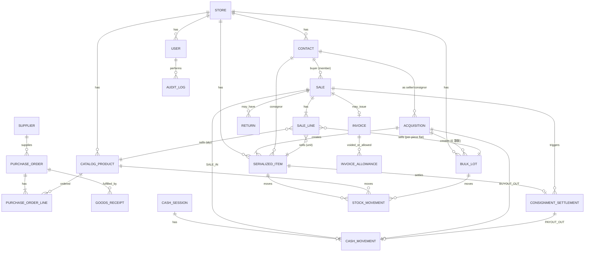

# 03 — 資料模型

原則：每張業務表帶 `store_id`、`created_at`、`updated_at`；金額用 `NUMERIC`（對應 Python `Decimal`）、**新台幣整數元**（scale 0 / quantize 到整數，ROUND_HALF_UP，含稅定價）；敏感欄位加密；狀態用列舉。以下為核心實體，欄位非窮舉，實作時補齊索引與約束。

## ERD（核心）

## 主要資料表

### store
`id, name, tax_id(統編), invoice_track_info(字軌設定), address, created_at`

### user
`id, store_id, username, password_hash, role(MANAGER|CLERK), is_active, created_at`

### contact（統一聯絡人）
- `id, store_id, name, phone, national_id_enc(加密), national_id_blind_index(HMAC(national_id,金鑰),供精確去重比對), roles(set: MEMBER|SELLER|CONSIGNOR), member_points, default_carrier_type?, default_carrier_id?(會員可選擇存常用雲端載具供下次免掃,需經同意), source_note, created_at`
- `national_id_enc` 僅 `MANAGER` 可解密；查看寫稽核。**不可明文/部分搜尋**；以 `national_id_blind_index` 做精確去重（HMAC 金鑰由環境/KMS 管理、不入 repo），日常查詢用姓名/電話。載具非 PII，明文即可。

### brand（品牌輕主檔）
`id, store_id, name, created_at`
- 店員可當場新增；建議 `(store_id, name)` 唯一。

### product_model（品名/型號主檔）
`id, store_id, brand_id, name(品名/型號), category_id, created_at`
- 收購時品名 autocomplete 的來源；選既有帶入品牌/分類與價格歷史，輸入全新則順手建一筆。建議 `(store_id, brand_id, name)` 唯一。
- **價格歷史**不另建表：依 `product_model_id` 聚合既有 `acquisition`（收購價）與 `sale_line`（售出價）取得。

### catalog_product（一般商品：飲料/新品）
`id, store_id, sku, name, brand_id?, category_id, unit_price, quantity_on_hand, reorder_point, cost_method, supplier_id?, create_idempotency_key?, create_fingerprint?, created_at`
- `(store_id, create_idempotency_key)` 在非空時唯一；建檔重送以 `create_fingerprint` 驗證內容相同後回放原商品，避免 SKU 留白時重複產生商品主檔。

### serialized_item（序號化單品：二手買斷/寄售，等級 S–D）
- `id, store_id, item_code(唯一條碼,建檔當下產生即固定、永不變), name, brand_id?, product_model_id?(型號主檔,供歷史/報表), category_id, grade(S|A|B|C|D), ownership_type(OWNED|CONSIGNMENT)`
- `item_code` 於建檔當下產生即**固定、永不變**，與 POS 掃描結帳所用為**同一套碼**；標籤以 **1D Code 128** 編碼此識別碼（內容只放 `item_code`），可隨時補印（見 04 列印端點）。
- `photos`：不存二進位於 DB；以關聯記錄存**檔案系統相對路徑 + metadata**（檔名、content_type、size），media 卷另行備份，路徑抽象化以便日後換物件儲存。
- `acquisition_cost`（OWNED 用）, `consignor_id`+`commission_pct`（CONSIGNMENT 用，預設 50）
- `listed_price, status(IN_STOCK|SOLD|RETURNED_TO_CONSIGNOR|WRITTEN_OFF), source_contact_id, acquisition_id, intake_date, sold_date`
- 約束：`ownership=OWNED` 必須有 `acquisition_cost`；`ownership=CONSIGNMENT` 必須有 `consignor_id` 與 `commission_pct`。E 級不走這張表，走 `bulk_lot`。

### bulk_lot（E 級二手散裝批：分堆、每堆固定均一價）
- `id, store_id, lot_code(唯一,可印標籤,建檔當下產生即固定、永不變), label(店員可命名,如「A堆」), name, brand_id?, category_id, grade(=E), acquisition_id, source_contact_id`
- `lot_code` 於建檔當下產生即**固定、永不變**，與 POS 掃描所用為**同一套碼**；標籤以 **1D Code 128** 編碼此識別碼（內容只放 `lot_code`），可隨時補印（見 04）。
- `acquisition_cost(整堆收購成本), acquisition_basis(WEIGHT|BAG|UNSPECIFIED), unit_price(每件固定均一價)`
- `total_qty(件數,入庫時記錄,可估算), remaining_qty, status(ON_SALE|SOLD_OUT|WRITTEN_OFF), intake_date`
- 每堆獨立記錄、可有各自的 `unit_price`（A 堆≠B 堆）。
- 每件成本 = `acquisition_cost / total_qty`（供毛利計算）。
- 約束：**確定追蹤件數**（`total_qty/remaining_qty` 必設）；售出時 `remaining_qty` 不得 < 0；歸零轉 `SOLD_OUT`。

### acquisition（收購/寄售入庫單）
`id, store_id, type(BUYOUT|CONSIGNMENT|BULK_LOT), contact_id, clerk_user_id, date, total_cash_paid(BUYOUT/BULK_LOT 用), note`
- `BUYOUT`/`CONSIGNMENT` 建立 `serialized_item`；`BULK_LOT` 建立 `bulk_lot`（付現）。

### supplier / purchase_order / purchase_order_line / goods_receipt
- `supplier`: `id, store_id, name, contact, tax_id?`
- `purchase_order`: `id, store_id, supplier_id, status(DRAFT|ORDERED|PARTIAL|RECEIVED|CANCELLED), ordered_at, ordered_by, received_at?, received_by?`
- `purchase_order_line`: `id, store_id, po_id, catalog_product_id, qty, received_qty, unit_cost`
- `goods_receipt`: `id, store_id, po_id, received_at, received_by, invoice_*, idempotency_key?, request_fingerprint?`；一張採購單可有多筆收貨批次

### sale（POS 交易）
`id, store_id, clerk_user_id, buyer_contact_id?, datetime, subtotal, tax, total, payment_method(CASH), invoice_status(ISSUED|NOT_ISSUED|VOID|ALLOWANCE), invoice_id?, status(COMPLETED|RETURNED)`

### sale_line
`id, sale_id, line_type(SERIALIZED|CATALOG|BULK_LOT), serialized_item_id?, catalog_product_id?, bulk_lot_id?, qty, unit_price, line_total`
- 約束：SERIALIZED 行 `qty=1` 且指向 `IN_STOCK` 的單品；BULK_LOT 行 `unit_price` 取該堆的均一價、扣 `bulk_lot.remaining_qty`。

### consignment_settlement（寄售結算）
`id, store_id, serialized_item_id, sale_id, gross, commission_pct, commission_amount, payout_amount, status(PENDING|PAID|CANCELLED), paid_at?, paid_by?, reclaim_needed(bool,已付款後退貨時為 true)`
- 計算（`commission_pct` 為整數百分數，預設 50）：`commission_amount = round_ntd(gross × commission_pct / 100)`；`payout_amount = gross − commission_amount`。
- 退貨反轉：未付款→`CANCELLED`；已付款→保留 `PAID` 並 `reclaim_needed=true`（應向寄售人收回）。

### invoice（電子發票）
`id, store_id, sale_id, invoice_number(字軌), invoice_type(B2C|B2B), buyer_tax_id?, carrier_type?(載具類別,如 3J0002 手機條碼/CQ0001 自然人憑證/會員載具代碼), carrier_id?(載具號碼,手機條碼為 8 碼且首碼/), print_mark(Y|N), donation_code?(捐贈碼 3-7 數字), amount, tax, status(ISSUED|UPLOADED|VOID|ALLOWANCE), mig_version, upload_status(PENDING|UPLOADED|FAILED), uploaded_at?`
- 載具非 PII，可明文儲存。`print_mark=N` 表示存雲端不印證明聯（用載具時預設）；`print_mark=Y` 印證明聯。
- 規則：手機條碼載具 `carrier_type=3J0002`、`carrier_id` 為 8 碼（首碼必為 `/`）；同時有買方統編與載具時，僅手機條碼情境成立（依 MIG 規範，實作時對照當前版本）。

### invoice_allowance（折讓單）
`id, invoice_id, amount, reason, return_id?, status, created_at`

### einvoice_upload_queue
`id, invoice_id?, allowance_id?, xml_path, action(ISSUE|VOID|ALLOWANCE), status(PENDING|UPLOADED|FAILED), attempts, last_error, created_at`

### return（退換貨）
`id, store_id, sale_id, datetime, refund_amount, reason, clerk_user_id`（明細關聯 sale_line / 回補庫存；已開票則產生 allowance）

### cash_session / cash_movement（現金對帳）
- `cash_session`: `id, store_id, opened_by, opened_at, opening_float, closed_by?, closed_at?, counted_amount?, expected_amount?, variance?`
- `cash_movement`: `id, session_id, type(SALE_IN|BUYOUT_OUT|CONSIGNMENT_PAYOUT_OUT|MANUAL_ADJUST), amount, ref_type, ref_id, created_at`（`BUYOUT_OUT` 涵蓋買斷與散裝收購之付現）
- 結帳 `expected = opening_float + Σ SALE_IN − Σ BUYOUT_OUT − Σ CONSIGNMENT_PAYOUT_OUT ± MANUAL_ADJUST`。

### stock_movement（庫存異動帳）
`id, store_id, item_kind(SERIALIZED|CATALOG|BULK_LOT), serialized_item_id?, catalog_product_id?, bulk_lot_id?, direction(IN|OUT|ADJUST), qty, reason(ACQUISITION|PURCHASE|SALE|RETURN|CONSIGN_RETURN|WRITE_OFF|STOCKTAKE), ref_type, ref_id, created_at`

### stocktake / stocktake_line（盤點）
`stocktake: id, store_id, status, started_by, started_at, closed_at?`
`stocktake_line: id, stocktake_id, item_kind, item_ref, system_qty, counted_qty, variance`

### audit_log（稽核，append-only）
`id, store_id, actor_user_id, action, entity_type, entity_id, before(json,去PII), after(json,去PII), is_sensitive, created_at`

### setting（系統設定，**單列具型別**，每店一列、Pydantic 驗證）
`einvoice_enabled(bool), default_commission_pct(int,=50), default_margin_pct(int,=45,定價輔助目標毛利率), tax_rate(=0.05), default_reorder_point, einvoice_print_proof_when_carrier(bool,預設 false), ...`
- `grade_enum`：S/A/B/C/D/E 六級（可設定用語）。預設語意：S=超熱門搶手貨、A=近全新/精品、B=良好、C=普通、D=較差、**E=散裝（秤斤/整袋收，走 bulk_lot）**。S–D 為序號單品，E 為散裝批。
