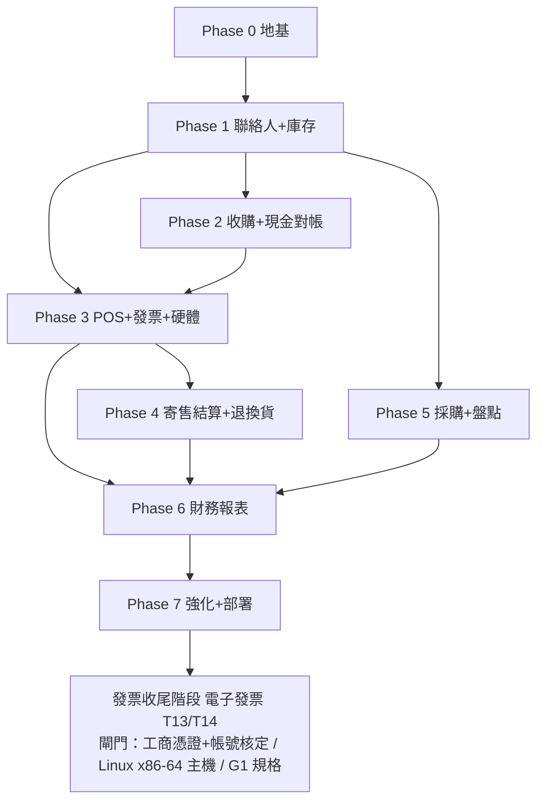

# 07 — 開發里程碑與相依順序

依相依關係由地基往上。每個 Phase 都遵守 TDD 與專案結構，完成定義含「測試通過 + 覆蓋率達標 + lint/type 全綠」。

## 相依關係

> **發票解耦**：電子發票（T13/T14）已從 Phase 3 抽出，集中於最末「發票收尾階段」（見文末）。`einvoice_enabled=false` 時銷售照常完整記錄（NOT_ISSUED），故其延後不阻擋 P3–P7。

## Phase 0 — 地基
- Monorepo、docker-compose、PostgreSQL、Alembic、本機品質關卡（lint/type/test/coverage/合約漂移）。
- `core/`：config、db（async session）、security（JWT、雜湊）、crypto（PII 加密）、audit、money（Decimal）、deps（角色/store 範圍）。
- `auth` 模組、`settings` 模組（含 `einvoice_enabled`、`default_commission_pct=50`）、`store`/`user` 基礎、`audit_log`。
- 測試骨架（真實 Postgres；目前以本機開發 DB + 交易回滾隔離，見 `docs/06`）。
- **驗收**：可登入、RBAC 生效、設定可讀寫、稽核可寫、本機品質關卡全綠。

## Phase 1 — 聯絡人 + 庫存
- `contacts`（統一主檔、角色、PII 加密與遮罩、解密查看寫稽核）。
- `inventory`：`catalog_product`（數量）與 `serialized_item`（序號，含 ownership/grade/photos/狀態機）、`stock_movement` 帳。
- **驗收**：可建會員/賣方、national_id 加密、可建/查兩型態庫存、狀態機受測。

## Phase 2 — 收購鑑價 + 現金對帳
- `acquisition`（BUYOUT/CONSIGNMENT 入庫、產 item_code、stock_movement IN、BUYOUT 觸發現金出帳）。
- `cashdrawer`（開帳/結帳/異動、expected 計算）。
- **驗收**：完整收購入庫；現金出帳正確；開/結帳對帳數字正確（含不變量測試）。

## Phase 3 — POS 銷售 + 硬體代理（電子發票已抽出，見「發票收尾階段」）
- **前置（foundational，序列）**：`settings` 模組（einvoice_enabled/tax_rate/default_commission_pct/default_margin_pct）、`core/money.split_tax_inclusive`、`shared/enums` 銷售/發票列舉。
- **閘門 G2（裝置狀態 B，已完成查證）**：兩家無官方 Python SDK；**Brother QL-810W 維持 Wi-Fi、A 級做、B 級標 `unsupported`**；**EPSON TM-T82iii A+B 皆做**（缺紙三態現成、cover/error/drawer 解析 DLE EOT）。每台 A/B 能力對照見 `docs/15-device-sdk-capability.md`，遵守 ADR-010「不臆造、不當故障」。
- `sales`（購物車、序號/數量混合、SALE_IN 現金、序號品轉 SOLD、stock OUT）。**已完成（T11/T12）。**
- `hardware-agent`（收據、證明聯、條碼標籤、開櫃；裝置狀態 A/B 依 `docs/15`）。
- **電子發票（`einvoice` 模組 T13/T14）已從本 Phase 抽出**，集中到文末「**發票收尾階段**」、排在所有其他 Phase/Wave 之後。理由＝**發票與系統已解耦**：`einvoice_enabled=false` 時每筆銷售仍完整寫入 `sales`（`invoice_status=NOT_ISSUED`，可日後補開，§6），前端發票區於未啟用時隱藏 → 移走發票不影響 sales / 硬體 / 前端的開發與上線。
- **驗收**：可結帳；`einvoice_enabled` on/off 行為正確且銷售皆完整記錄；可列印/開櫃（fake + 實機）。**（不含發票 XML 上傳，留待收尾階段。）**

## 購物金階段（store credit，插於硬體完成後、T19 POS 前端之前；見 `docs/16`、ADR-012）

> 2026-06-11 新增需求：收購撥款可選現金或購物金（可設溢價）；購物金為帳上負債、
> insert-only 帳本為事實來源。**SC-1～3 是 T19 POS 結帳 UI 的前置**；SC-4/5 可與 T19 並行。

- **點數小任務**：結帳累積 `floor(total/100)` 點（購物金支付照計、收購不給點、void 沖回；docs/16 §0）。與 pre-A（auth login）、pre-B（inventory 唯讀查詢）同屬 T19 前置後端補洞。
- **SC-1 帳本核心**：`store_credit_ledger` + `store_credit_accounts` + 不變量 I-1～I-11 + 對帳 + 查詢/人工校正端點。
- **SC-2 收購撥款整合**：payout `CASH | STORE_CREDIT | SPLIT`，與收購同一原子交易。
- **SC-3 銷售 tender 整合**：`sale_tenders` 多付款、`InsufficientStoreCredit` 守衛、void 沖正。
- **SC-4 報表 API + 匯出**：負債/帳齡/流量/效益指標（α 為代理法估計值）＋ CSV/Excel。
- **SC-5 溢價設定 + 建議值引擎**：premium_rate（金錢級設定、history 留痕）、deterministic 規則式建議值、suggestion_log、永不自動生效。
- **G3 閘門**：待會計師確認「禮券/儲值歸類、效期與履約保證、溢價稅務認列時點」；不阻擋建模，效期欄位（暫定永久不過期）待定案。

## Phase 4 — 寄售結算 + 退換貨
- `consignment`（賣出觸發 settlement、付款流程、應付彙總、退回寄售人）。
- `returns`（退現金、回補庫存、已開票產生折讓單 allowance）。
- **驗收**：寄售拆帳與付款正確；退貨折讓流程正確（不變量測試）。
- **發票解耦註記**：退貨折讓在 `einvoice_enabled=false` 時僅產生/記錄 allowance（不實際上傳）；折讓的 **G0401/G0501 XML 產生與上傳** 一併留待「發票收尾階段」實作，不阻擋本 Phase。

## Phase 5 — 採購 + 盤點
- `purchasing`（supplier、PO、收貨入庫、低庫存提醒）。
- `stocktake`（盤點、差異、ADJUST 異動）。
- **驗收**：進貨流程與庫存帳一致；盤點差異正確調整並留痕。

## Phase 6 — 財務報表分析
- `reporting`：每日現金對帳、營收/成本/毛利（買斷成本 vs 寄售只認抽成）、庫存價值與庫齡、寄售應付、趨勢、匯出 CSV/Excel。
- v1 拆分、購物金報表沖正一致性與匯出交叉驗證規則見 `docs/19-reports-and-risk-review-plan.md`。
- **驗收**：報表數字與底層交易一致（用既有測資交叉驗證）。

## Phase 7 — 強化與部署
- 自動備份（pg_dump + 雲端）與還原演練文件。
- 觀測性（結構化 log、告警：發票漏傳、對帳差異）。
- 部署文件（店內伺服器、Turnkey 目錄掛載、硬體代理上機）。
- `notification` 介面確認預留（仍 no-op）。
- 安全複查（PII、金鑰、權限）。
- **驗收**：可一鍵部署、備份可還原、e2e 全綠。

## 發票收尾階段（電子發票，延後至最後實作）

> **電子發票整包（`einvoice` 模組 T13、e-invoice API T14、Turnkey 環境搭建與憑證接線）從原 Wave 3/4 抽出**，集中於此、排在**所有其他 Phase/Wave 之後**。因發票與系統已解耦（見 Phase 3 註記），此階段延後不影響 sales / 硬體 / 前端的開發與上線。

- **前置閘門（三者齊備才動工，缺一不可）**：
  1. **憑證/帳號**：工商憑證（MOEACA）申請完成 **＋** 平台帳號核定（含 Turnkey 申請，審核約 3 工作天）。
  2. **主機**：Linux x86-64 主機備妥（**選項 A：與門市後端同機**；非 mac/Apple Silicon）。
  3. **規格**：G1 完整規格與本次調查已落 repo（`docs/14`，含 §5 部署/憑證/流程盤點）。
  - 另需釐清：主憑證政策（待打客服 02-89782365）、防火牆對外固定 IP 開通（SFTP 2222＋HTTPS、非中國大陸 IP）。
- **工作項**：
  - 環境：Turnkey 3.2.1 安裝（OpenJDK 17、獨立 PostgreSQL DB、目錄設定 V4.1、headless `run_cmd.sh`）。
  - **T13 `einvoice` 模組**：MIG 4.1 XML 產生（F0401/F0501/F0701 + 折讓 G0401/G0501）、拋 `UpCast/B2SSTORAGE/<msg>/SRC`、upload queue、回讀 `TURNKEY_MESSAGE_LOG` 對帳、開關控制；依 `docs/14` 為準，動工前仍須對齊實際 XSD 欄位長度/Enum，不得憑摘要硬寫。
  - **T14 e-invoice API**：開立/重送/查 ProcessResult/折讓 端點。
- **驗收**：`einvoice_enabled=true` 時 XML 可產生並經 Turnkey 上傳、ProcessResult 可對帳；關閉時銷售仍完整記錄（NOT_ISSUED）。

## 橫切延後項時機（D-3 / D-4，詳 `docs/deferred-items.md`）
- **D-4（auth 強化，跨切）**：敏感操作改為重查 DB 驗證當前 `role==MANAGER` 與 `is_active`，集中於 `deps.py`/auth。**建議時機：前端（T19/T20）與真錢交易上線之前**完成，避免帶著「全憑 JWT claim」的設計進到使用者實際操作期。
- **D-3（sale-void vs invoice-void 模型）**：**建議時機：與 Phase 4 退換貨一併評估**（是否拆 `SaleStatus.VOIDED`）。

## 預留（未來）
- 多分店上線（雲端/同步）、通知（LINE/簡訊）、加值中心 API、會員行銷/點數進階。
