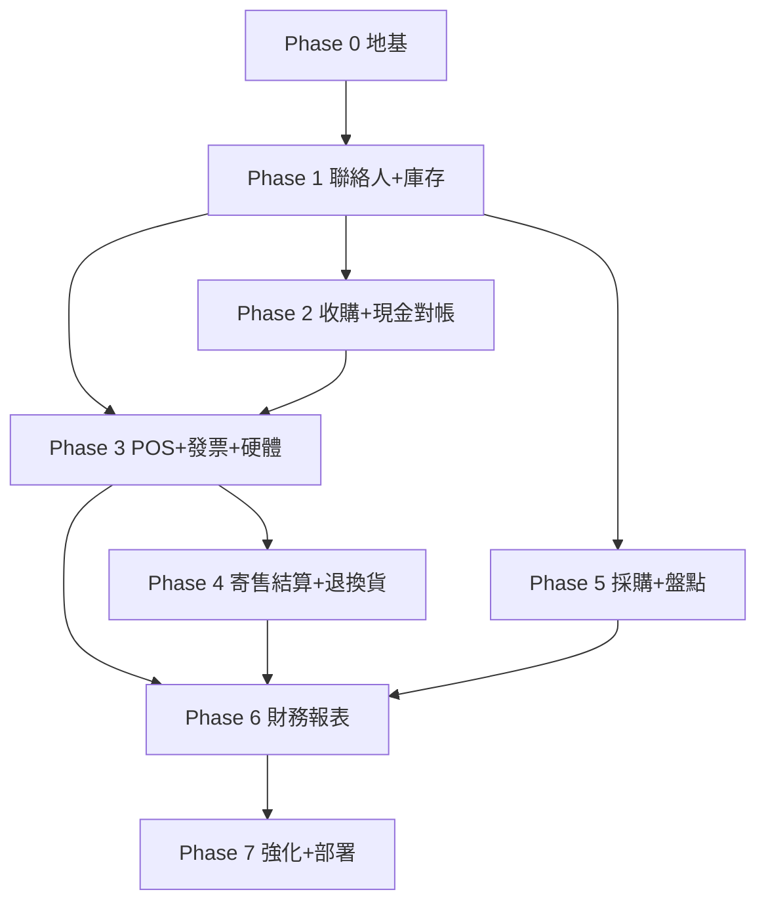

# 07 — 開發里程碑與相依順序

依相依關係由地基往上。每個 Phase 都遵守 TDD 與專案結構，完成定義含「測試通過 + 覆蓋率達標 + lint/type 全綠」。

## 相依關係

## Phase 0 — 地基
- Monorepo、docker-compose、PostgreSQL、Alembic、CI（lint/type/test/coverage gate）。
- `core/`：config、db（async session）、security（JWT、雜湊）、crypto（PII 加密）、audit、money（Decimal）、deps（角色/store 範圍）。
- `auth` 模組、`settings` 模組（含 `einvoice_enabled`、`default_commission_pct=50`）、`store`/`user` 基礎、`audit_log`。
- 測試骨架（testcontainers Postgres、factories）。
- **驗收**：可登入、RBAC 生效、設定可讀寫、稽核可寫、CI 全綠。

## Phase 1 — 聯絡人 + 庫存
- `contacts`（統一主檔、角色、PII 加密與遮罩、解密查看寫稽核）。
- `inventory`：`catalog_product`（數量）與 `serialized_item`（序號，含 ownership/grade/photos/狀態機）、`stock_movement` 帳。
- **驗收**：可建會員/賣方、national_id 加密、可建/查兩型態庫存、狀態機受測。

## Phase 2 — 收購鑑價 + 現金對帳
- `acquisition`（BUYOUT/CONSIGNMENT 入庫、產 item_code、stock_movement IN、BUYOUT 觸發現金出帳）。
- `cashdrawer`（開帳/結帳/異動、expected 計算）。
- **驗收**：完整收購入庫；現金出帳正確；開/結帳對帳數字正確（含不變量測試）。

## Phase 3 — POS 銷售 + 電子發票 + 硬體代理
- **前置（foundational，序列）**：`settings` 模組（einvoice_enabled/tax_rate/default_commission_pct/default_margin_pct）、`core/money.split_tax_inclusive`、`shared/enums` 銷售/發票列舉。
- **閘門 G1（電子發票，已完成查證）**：採 **MIG 4.0/4.1（F0401/F0501/F0701 + G0401/G0501）+ Turnkey 3.9**；對照骨架見 `docs/14-einvoice-mig-mapping.md`。T13 動工前仍須下載 Turnkey 3.9 完整手冊與 MIG 規格，依實際 XSD 欄位長度/Enum 與目錄/回執格式實作，不得憑摘要硬寫。
- **閘門 G2（裝置狀態 B，已完成查證）**：兩家無官方 Python SDK；**Brother QL-810W 維持 Wi-Fi、A 級做、B 級標 `unsupported`**；**EPSON TM-T82iii A+B 皆做**（缺紙三態現成、cover/error/drawer 解析 DLE EOT）。每台 A/B 能力對照見 `docs/15-device-sdk-capability.md`，遵守 ADR-010「不臆造、不當故障」。
- `sales`（購物車、序號/數量混合、SALE_IN 現金、序號品轉 SOLD、stock OUT）。
- `einvoice`（MIG 4.0/4.1 XML 產生、拋 Turnkey 目錄、upload queue、ProcessResult 對帳、開關控制；依 `docs/14` 為準）。
- `hardware-agent`（收據、證明聯、條碼標籤、開櫃；裝置狀態 A/B 依 `docs/15`）。
- **驗收**：可結帳；開關 on/off 行為正確且銷售皆完整記錄；發票 XML 可拋出/排隊；可列印/開櫃（fake + 實機）。

## Phase 4 — 寄售結算 + 退換貨
- `consignment`（賣出觸發 settlement、付款流程、應付彙總、退回寄售人）。
- `returns`（退現金、回補庫存、已開票產生折讓並排上傳）。
- **驗收**：寄售拆帳與付款正確；退貨折讓流程正確（不變量測試）。

## Phase 5 — 採購 + 盤點
- `purchasing`（supplier、PO、收貨入庫、低庫存提醒）。
- `stocktake`（盤點、差異、ADJUST 異動）。
- **驗收**：進貨流程與庫存帳一致；盤點差異正確調整並留痕。

## Phase 6 — 財務報表分析
- `reporting`：每日現金對帳、營收/成本/毛利（買斷成本 vs 寄售只認抽成）、庫存價值與庫齡、寄售應付、趨勢、匯出 CSV/Excel。
- **驗收**：報表數字與底層交易一致（用既有測資交叉驗證）。

## Phase 7 — 強化與部署
- 自動備份（pg_dump + 雲端）與還原演練文件。
- 觀測性（結構化 log、告警：發票漏傳、對帳差異）。
- 部署文件（店內伺服器、Turnkey 目錄掛載、硬體代理上機）。
- `notification` 介面確認預留（仍 no-op）。
- 安全複查（PII、金鑰、權限）。
- **驗收**：可一鍵部署、備份可還原、e2e 全綠。

## 預留（未來）
- 多分店上線（雲端/同步）、通知（LINE/簡訊）、加值中心 API、會員行銷/點數進階。
