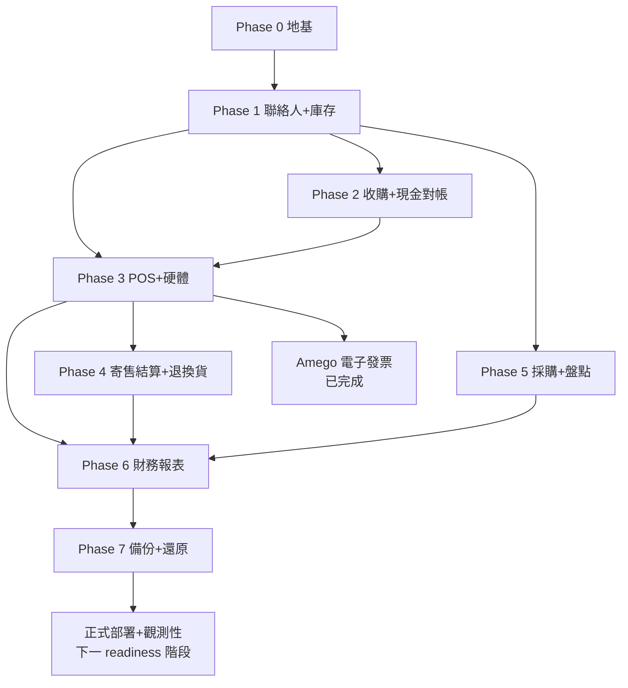

# 07 — 開發里程碑與相依順序

依相依關係由地基往上。每個 Phase 都遵守 TDD 與專案結構，完成定義含「測試通過 + 覆蓋率達標 + lint/type 全綠」。

> 實作狀態（2026-07-22）：Phase 0–6 已落地；Phase 7 的完整備份／還原已完成，正式部署與
> 觀測性仍屬下一個 readiness 階段。原「發票收尾階段」改採 Amego API 並已完成。
> 本文件保留相依順序與驗收定義，最新實況以 `docs/current-status.md` 為準。

## 相依關係

> **發票路線更新**：原 T13/T14 自建 Turnkey 路線已停用，改採 Amego API 並完成；詳見
> `docs/24-amego-einvoice.md`。`einvoice_enabled=false` 時銷售仍照常完整記錄（NOT_ISSUED）。

## Phase 0 — 地基
- Monorepo、docker-compose、PostgreSQL、Alembic、本機品質關卡（lint/type/test/coverage/合約漂移）。
- `core/`：config、db（async session）、security（JWT、雜湊）、crypto（PII 加密）、audit、money（Decimal）、deps（角色/store 範圍）。
- `auth` 模組、`settings` 模組（含 `einvoice_enabled`、`default_commission_pct=50`）、`store`/`user` 基礎、`audit_log`。
- 測試骨架（真實 Postgres；目前以本機開發 DB + 交易回滾隔離，見 `docs/06`）。
- **驗收**：可登入、RBAC 生效、設定可讀寫、稽核可寫、本機品質關卡全綠。

## Phase 1 — 聯絡人 + 庫存
- `contacts`（統一主檔、角色、PII 加密與遮罩、解密查看寫稽核）。
- `inventory`：`catalog_product`（一般商品，以數量管理）與 `serialized_item`（序號，含 ownership/grade/photos/狀態機）、`stock_movement` 帳。
- **驗收**：可建會員/賣方、national_id 加密、可建/查兩型態庫存、狀態機受測。

## Phase 2 — 收購鑑價 + 現金對帳
- `acquisition`（BUYOUT/CONSIGNMENT 入庫、產 item_code、stock_movement IN、BUYOUT 觸發現金出帳）。
- `cashdrawer`（開帳/結帳/異動、expected 計算）。
- **驗收**：完整收購入庫；現金出帳正確；開/結帳對帳數字正確（含不變量測試）。

## Phase 3 — POS 銷售 + 硬體代理
- **前置（foundational，序列）**：`settings` 模組（einvoice_enabled/tax_rate/default_commission_pct/default_margin_pct）、`core/money.split_tax_inclusive`、`shared/enums` 銷售/發票列舉。
- **閘門 G2（裝置狀態 B，已完成查證）**：兩家無官方 Python SDK；**Brother QL-810W 維持 Wi-Fi、A 級做、B 級標 `unsupported`**；**EPSON TM-T82iii A+B 皆做**（缺紙三態現成、cover/error/drawer 解析 DLE EOT）。每台 A/B 能力對照見 `docs/15-device-sdk-capability.md`，遵守 ADR-010「不臆造、不當故障」。
- `sales`（購物車、序號/數量混合、SALE_IN 現金、序號品轉 SOLD、stock OUT）。**已完成（T11/T12）。**
- `hardware-agent`（收據、證明聯、條碼標籤、開櫃；裝置狀態 A/B 依 `docs/15`）。
- **電子發票後續成果**：Amego 開立／作廢／折讓／查詢及 POS／證明聯整合均已完成，
  但仍維持與 sales 解耦；關閉時每筆銷售保留 `NOT_ISSUED`。
- **驗收**：可結帳；`einvoice_enabled` on/off 行為正確且銷售皆完整記錄；可列印/開櫃（fake + 實機）。

## 購物金階段（store credit，插於硬體完成後、T19 POS 前端之前；見 `docs/16`、ADR-012）

> 2026-06-11 新增需求：收購撥款可選現金或購物金（可設溢價）；購物金為帳上負債、
> insert-only 帳本為事實來源。**SC-1～3 是 T19 POS 結帳 UI 的前置**；SC-4/5 可與 T19 並行。

- **點數小任務**：結帳累積 `floor(total/100)` 點（購物金支付照計、收購不給點、void 沖回；docs/16 §0）。與 pre-A（auth login）、pre-B（inventory 唯讀查詢）同屬 T19 前置後端補洞。
- **SC-1 帳本核心**：`store_credit_ledger` + `store_credit_accounts` + 不變量 I-1～I-11 + 對帳 + 查詢/人工校正端點。
- **SC-2 收購撥款整合**：payout `CASH | STORE_CREDIT | SPLIT`，與收購同一原子交易。
- **SC-3 銷售 tender 整合**：`sale_tenders` 多付款、`InsufficientStoreCredit` 守衛、void 沖正。
- **SC-4 報表 API + 匯出**：負債/帳齡/流量/效益指標（α 為代理法估計值）＋ CSV/Excel。
- **SC-5 溢價設定 + 建議值引擎**：premium_rate（金錢級設定、history 留痕）、deterministic 規則式建議值、suggestion_log、永不自動生效。
- **G3 閘門**：待會計師確認「禮券/儲值歸類、效期與履約保證、溢價稅務認列時點」；不阻擋建模，效期欄位（暫定永久不過期）待定案。

## Phase 4 — 寄售結算 + 退換貨
- `consignment`（賣出觸發 settlement、付款流程、應付彙總、退回寄售人）。
- `returns`（退現金、回補庫存、已開票產生折讓單 allowance）。
- **驗收**：寄售拆帳與付款正確；退貨折讓流程正確（不變量測試）。
- **發票整合成果**：退貨可建立 Amego allowance；平台成功後才進正式折讓狀態，失敗保留可重試／對帳狀態。

## Phase 5 — 採購 + 盤點
- `purchasing`（supplier、PO、收貨入庫、低庫存提醒）。
- `stocktake`（盤點、差異、ADJUST 異動）。
- **驗收**：進貨流程與庫存帳一致；盤點差異正確調整並留痕。

## Phase 6 — 財務報表分析
- `reporting`：每日現金對帳、營收/成本/毛利（買斷成本 vs 寄售只認抽成）、庫存價值與庫齡、寄售應付、趨勢、匯出 CSV/Excel。
- v1 拆分、購物金報表沖正一致性與匯出交叉驗證規則見 `docs/19-reports-and-risk-review-plan.md`。
- **驗收**：報表數字與底層交易一致（用既有測資交叉驗證）。

## Phase 7 — 備份／還原已完成；部署 readiness 待續

- **已完成**：due-driven `pg_dump` 全庫備份、AES 加密、R2 上傳、retention、儀表板／健康告警、
  guarded throwaway-DB 還原、驗證與 23/23 功能演練（docs/28、docs/31）。
- **下一階段**：正式服務監管與 restart policy、結構化 log／rotation、聚合健康告警、店內主機／
  網路／硬體代理上機，以及一鍵部署與完整 release rehearsal。
- **外部輸入**：正式 Amego／LINE Pay／R2 憑證、店外備份口令保管與實際硬體網路條件。
- **驗收**：備份已證明可還原；部署 readiness 須再達到服務可恢復、告警可觸發、release checklist 全綠。

## 電子發票成果（Amego 路線已完成）

- 原自建 Turnkey T13/T14、MIG 拋檔與 Linux Turnkey 主機方案已由 Amego API 路線取代；
  docs/14、docs/18 僅保留歷史研究，不是施工依據。
- 已完成 B2B/B2C 開立、作廢、折讓、查詢對帳、重試狀態、POS 欄位與 EPSON 證明聯；
  實作與驗證證據見 docs/24。
- 唯一仍開的政策閘門是 G3：購物金的會計／稅務分類及開票時點須由會計師裁示。

## 橫切延後項（詳 `docs/deferred-items.md`）

- **D-4 ✅**：每次 authenticated request 重查 DB 的 current role/store/active 狀態，已完成。
- **D-3（刻意保留）**：sale void 仍借用 `invoice_status=VOID`；是否另拆獨立取消狀態機，
  只有在產品需要區分更多取消語意時再評估，不是目前功能 blocker。

## 預留（未來）
- 多分店上線（雲端/同步）、通知（LINE/簡訊）、加值中心 API、會員行銷/點數進階。
