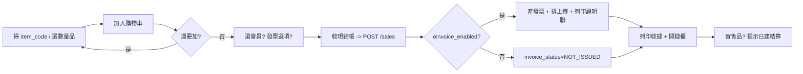
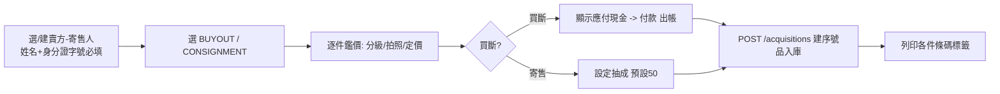
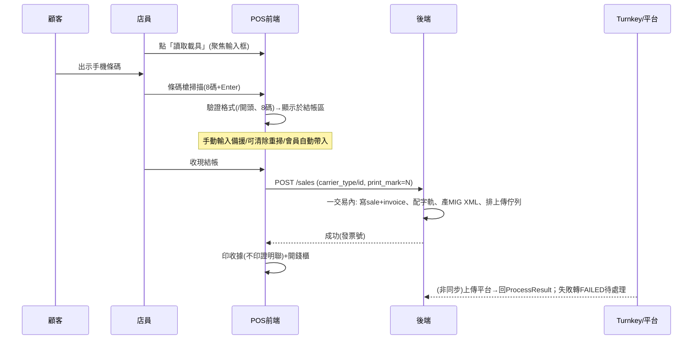

# 10 — 前端規格（Next.js）

補齊前端的畫面、流程、資料策略、硬體整合、角色差異與測試。與 `04-api-spec.md` 的端點、`01-requirements.md` 的行為一致；實作時遵守 `CLAUDE.md` 與 `08-workflow.md`。

## 1. 設計方向（門市操作優先）

這是**店員每天高頻使用的內部操作工具**，不是行銷網站。優先順序：操作速度 > 清晰防錯 > 美觀。

- **條碼/鍵盤優先**：核心流程（結帳、收購）能不靠滑鼠完成；掃碼即加入。
- **高對比、大字、大點擊區**：櫃檯環境、可能觸控；避免細小密集元素。
- **最少點擊、明確主行動**：每頁一個顯眼主按鈕；危險/敏感動作需二次確認。
- **狀態清楚**：載入、空、錯誤、離線（硬體代理/外網）都有明確呈現，不靜默失敗。
- 實作 UI 元件細節可參考 `frontend-design` 技能做打磨，但**不要為了視覺犧牲操作效率**；採乾淨、克制、一致的設計系統（CSS 變數 + 設計 token）。

## 2. 技術與資料策略

- Next.js App Router + TypeScript（strict）。前端透過 **LAN** 連店內 FastAPI（不做離線 PWA，見 ADR-006）。
- **資料抓取/變更**：用 TanStack Query（React Query）做查詢快取與 mutation；伺服器元件可做唯讀預取，互動性頁面（POS/收購）用客戶端元件。
- **型別防漂移（重要）**：`lib/api.ts` 的型別由後端 OpenAPI 產生（如 `openapi-typescript`），不手刻、不臆測欄位。後端改 API → 重新產型別 → 前端編譯期就抓到不一致。
- **金額**：一律以字串/整數分傳輸與顯示，**禁止 float**；顯示/解析走 `lib/money.ts`。
- **認證**：登入取 JWT（access + refresh）；`lib/auth.ts` 統一附帶 token、過期自動 refresh、401 導回登入。token 不落不安全儲存。
- **錯誤處理**：統一解析後端 `{ error: { code, message, details } }`，以 toast/inline 呈現；表單錯誤對應欄位。

## 3. 跨頁共用行為

- **條碼槍**：HID 鍵盤模擬。實作全域掃碼監聽（偵測快速連續輸入 + Enter 結尾），把碼路由到當前情境（POS 加入購物車 / 庫存查件）。需處理輸入焦點，避免被表單吃掉。
- **硬體代理**：透過 `lib/hardware.ts` 呼叫 localhost 列印（收據/證明聯/標籤）與開錢櫃；代理離線時顯示明確錯誤與重試，且**不可阻擋交易已成立的資料**（交易已寫後端，列印失敗可重印）。
- **敏感/危險動作二次確認**：作廢、退貨、改價、現金調整、解密查看身分證字號。
- **角色感知 UI**：依登入角色顯示/隱藏功能（見 §4）。

## 4. 角色差異（CLERK vs MANAGER）

| 功能 | CLERK | MANAGER |
|------|-------|---------|
| POS 結帳 / 收購 / 寄售操作 / 現金開結帳 | ✅ | ✅ |
| 作廢、改價、現金手動調整 | 需權限/留痕 | ✅ |
| 身分證字號「解密查看」 | ❌（僅遮罩） | ✅（查看寫稽核） |
| 報表、設定、使用者/權限管理 | ❌ | ✅ |

未授權的頁面/按鈕不顯示，且後端仍須再次驗權（前端隱藏不等於安全）。

## 5. 畫面規格（逐頁）

每頁列出：用途、主要元素、主行動、對應 API、角色。

- **/login**：帳密登入 → 取 token。API：`/auth/login`。全角色。
- **/pos（結帳）**：掃 `item_code`（序號品）、選數量商品、或選/掃**散裝堆**（E，按該堆均一價、可一次多件）加入購物車；右側結帳區顯示小計/稅/總額、會員歸戶（選填）、發票選項。發票區支援：**掃消費者手機條碼載具**（條碼槍掃入，前端驗證 8 碼且首碼 `/`，帶入 `carrier_type=3J0002`+`carrier_id`）、自然人憑證載具、捐贈碼、B2B 統編；會員若有存常用載具則自動帶入、可覆蓋。用載具時預設 `print_mark=N`（不印證明聯、存雲端），仍印收據；可切換。若 `einvoice_enabled=false` 則整個發票區隱藏並標示「本期不開票」。主行動「收現結帳」→ 後端建 sale →（開票時）產發票 + 排上傳 → 觸發列印（依 print_mark）、開錢櫃。**結帳完成畫面顯示「列印商品明細」按鈕，店員視客人需求手動點選列印（可重複補印）**；非自動印。寄售品售出由後端自動建結算、前端提示。API：`/sales`、`/sales/{id}/print-detail`、`/serialized-items/by-code/{code}`、`/settings`。
- **/acquisition（收購鑑價入庫）**：先選/建賣方或寄售人（**姓名、身分證字號必填**；身分證號可由後端 blind index 去重比對既有賣方）→ 選類型：
  - 買斷/寄售（S–D）：逐件鑑價（**品牌選擇可當場新增**、**品名 autocomplete 既有型號**[選既有自動帶入品牌/分類與價格歷史，輸入全新則順手建型號]、分類、成色 S–D、選填拍照、定價；買斷填收購價、寄售填拋售價與抽成預設 50）。
    - **定價輔助 UI（定價計算機）**：輸入收購價後，顯示依目標毛利率算的**建議含稅售價**（`round_ntd(收購價 ÷ (1 − margin_pct/100))`，`default_margin_pct` 預設 45、margin 限 0–99）與**該型號歷史售價**參考；店員可手動覆蓋毛利率或售價任一數字。
  - **散裝（E）**：建立一「堆」——選品牌、填整堆收購成本、收購基準（秤斤/整袋）、件數（可估算）、**該堆每件均一價**、可命名（如「A堆」）。
  買斷/散裝顯示「應付現金」並提示付款（現金出帳）；完成後列印序號條碼或整堆標籤。API：`/acquisitions`、`/acquisitions/{id}/print-labels`、`/contacts`、`/contacts/lookup`、`/brands`、`/product-models`、`/product-models/{id}/pricing`。
- **/inventory**：三個分頁——序號品（S–D，可篩 status/ownership、查件、改價留痕、上下架、看照片）、數量品（庫存量、低庫存標示、改價）、**散裝批（E）**（各堆：均一價、剩餘/總件數、收購成本、售出進度；改價/調整件數留痕）。API：`/serialized-items`、`/catalog-products`、`/bulk-lots`。
- **/consignment**：待結算/應付未付清單；「付款給寄售人」（現金出帳）；退回寄售人。API：`/consignment/*`。
- **/contacts**：會員/賣方/寄售人查詢與建檔；會員消費紀錄/點數；身分證字號預設遮罩，MANAGER 可解密查看（寫稽核）。API：`/contacts*`。
- **/purchasing**：供應商、採購單、收貨入庫、低庫存提醒。API：`/suppliers`、`/purchase-orders`、`/purchase-orders/{id}/receive`。
- **/cash（現金對帳）**：開帳（輸入零用金）、當前 session 現金異動清單、結帳（輸入實點金額 → 顯示系統應有與差異）。API：`/cash-sessions/*`。
- **/stocktake**：建盤點單、掃描/輸入實際數、顯示差異、確認調整。API：`/stocktakes/*`。
- **/reports（MANAGER）**：每日現金對帳、營收/成本/毛利（區分買斷成本與寄售只認抽成）、庫存價值與庫齡、寄售應付、趨勢；匯出 CSV/Excel。API：`/reports/*`。
- **/settings（MANAGER）**：發票開關 `einvoice_enabled`、預設寄售抽成、稅率/稅務處理、成色分級列舉、reorder 預設、店家/發票資訊。API：`/settings`。

## 6. 關鍵流程

### POS 結帳


### 收購鑑價入庫


## 7. 表單與驗證

- 前端驗證鏡像後端規則，但**以後端為最終權威**。
- 收購/寄售：姓名、身分證字號必填；身分證字號為遮罩輸入，MANAGER 才有「查看」。
- 金額輸入限制格式、用 `lib/money.ts`，禁止 float。
- 必填、格式、邊界錯誤以 inline 訊息呈現；提交失敗對應後端 error details。

## 8. 前端測試（對應 06）

- **元件/邏輯**：vitest + React Testing Library——購物車計算（顯示用，金額正確）、發票選項依開關顯示/隱藏、角色 UI 顯示/隱藏、身分證遮罩、表單驗證、條碼輸入解析。
- **e2e（Playwright）**：對應 §6 的關鍵流程——完整 POS 結帳（開票/不開票兩種）、收購買斷（必填擋關、付現、印標籤）、寄售售出→結算→付款、退貨→折讓、現金開結帳對帳。
- **型別**：`tsc --strict` 全綠；API 型別由後端 OpenAPI 產生。
- 不變量：金額顯示無 float 誤差；`einvoice_enabled=false` 時前端不顯示發票欄位但結帳仍成立。

## 9. 裝置與環境

- 桌機/觸控櫃檯螢幕為主；版面在常見 POS 解析度可用。
- 依賴店內伺服器在線（LAN）；硬體代理在 POS 機本機（localhost）。
- 條碼槍即插即用（HID）；印表機/錢櫃由硬體代理驅動。

## 附錄 B — 雲端載具讀取流程（POS，定案）

條碼槍 = HID 鍵盤（掃描即「打字」8 碼 + Enter）。重點是**焦點控制**，確保掃到的碼進載具欄、不被商品掃描欄誤吃。

流程：店員點「讀取載具」→ 進入載具讀取模式（聚焦輸入框/小視窗）→ 顧客出示手機條碼 → 掃描（8 碼 + Enter）→ 前端即時驗格式（首碼 `/`、8 碼、合法字元）→ 帶 `carrier_type=3J0002` + `carrier_id`，顯示於結帳區。備援：可手動鍵入、可清除重掃；會員若存過常用載具則自動帶入、可覆蓋。

結帳：後端在**一個交易**內寫 `sale`+`invoice`（含 carrier、`print_mark=N`）、配字軌、產 MIG XML 拋 Turnkey 目錄、排上傳佇列 → 回發票號 → 前端印收據（不印證明聯）+ 開錢櫃。

重點認知：
- **Turnkey 上傳為非同步**，不卡結帳；斷網時排隊、恢復後補送（離線韌性）。
- POS 只驗「格式」；載具是否存在由平台在上傳時驗，失敗則該筆上傳佇列轉 `FAILED`，需告警與後續處理（補開紙本/更正）。
- 邊界：無載具（正常開立、`print_mark=Y` 印證明聯）／B2B 統編／捐贈碼／統編＋載具（依 MIG 僅手機條碼情境成立，實作對照當前規格）。



## 附錄 A — 設計 token 基線（風格一致用）
定義一套設計 token，讓每個畫面風格一致、不會各做各的。**以可讀性與操作速度為先**；以下為大地/戶外色系（呼應露營裝備店），實作時放進 CSS 變數（或 Tailwind theme），全站只用 token、不寫死色碼。實作 UI 元件可參考 `frontend-design` 技能做細節，但維持此基線、避免罐頭 AI 風（勿用 Inter/Roboto 與紫漸層）。

```css
:root {
  /* 色彩：中性大地 + 單一沉穩主色 + 功能色 */
  --bg:        #F5F1E8;  /* 暖砂背景 */
  --surface:   #FFFFFF;  /* 卡片/面板 */
  --ink:       #23291F;  /* 主要文字（深墨綠灰） */
  --ink-soft:  #5C6354;  /* 次要文字 */
  --border:    #DcD6C8;
  --accent:    #2F5D3A;  /* 森林綠：主行動/重點 */
  --accent-ink:#FFFFFF;
  --success:   #2E7D4F;
  --warn:      #B8860B;
  --danger:    #B23A2E;  /* 作廢/退貨/刪除 */
  --info:      #2C6E8F;

  /* 字體：可讀為先；數字用等寬對齊金額 */
  --font-display: "Fraunces", Georgia, serif;      /* 標題，具個性又好讀 */
  --font-body:    "IBM Plex Sans", system-ui, sans-serif;
  --font-mono:    "IBM Plex Mono", ui-monospace, monospace; /* 價格/數量/條碼 */

  /* 字級 */
  --text-xl: 28px; --text-lg: 22px; --text-md: 17px; --text-sm: 14px;

  /* 間距（8 基準） */
  --sp-1:4px; --sp-2:8px; --sp-3:12px; --sp-4:16px; --sp-6:24px; --sp-8:32px;

  /* 圓角/陰影/點擊區 */
  --radius: 10px;
  --shadow: 0 1px 2px rgba(35,41,31,.06), 0 4px 16px rgba(35,41,31,.06);
  --tap-min: 44px;   /* 主要可點元素最小高度，利觸控 */
}
```

元件慣例：
- **按鈕**：主行動用 `--accent` 實心、字大、`min-height: var(--tap-min)`；危險動作（作廢/退貨/刪除）用 `--danger` 且需二次確認。每頁只有一個主行動。
- **金額/數量**：一律 `--font-mono`、右對齊、千分位；強調用較大字級。
- **輸入框**：大、邊框清楚、聚焦態明顯；錯誤態邊框 `--danger` + 欄位下方訊息。
- **表格**（庫存/報表）：列高足、斑馬紋低調、可掃讀；狀態用 badge。
- **狀態 badge**：IN_STOCK/SOLD/PENDING/PAID/FAILED 等用一致顏色語意（成功綠、警告金、危險紅、資訊藍、中性灰）。
- **Toast/對話框**：操作結果與錯誤明確；硬體/離線錯誤可重試。
- **密度**：櫃檯操作頁（POS/收購）資訊密度適中、按鈕大；報表頁可較密。
- 一致使用上述 token；深淺色可後續再加，但先以此淺色基線統一。